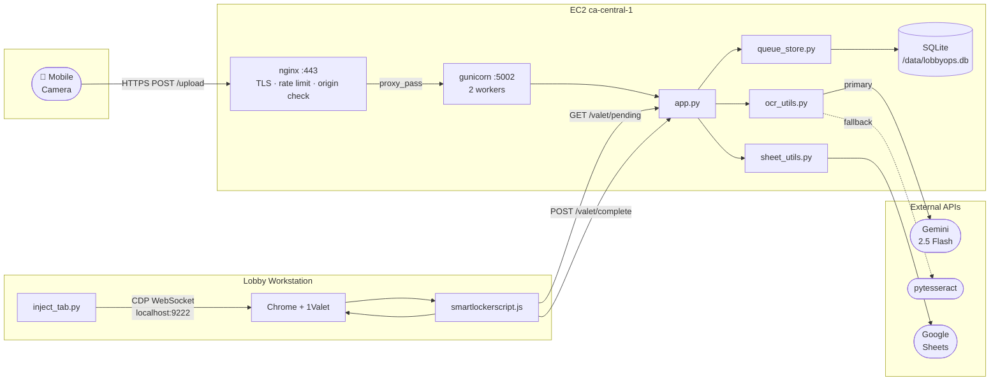
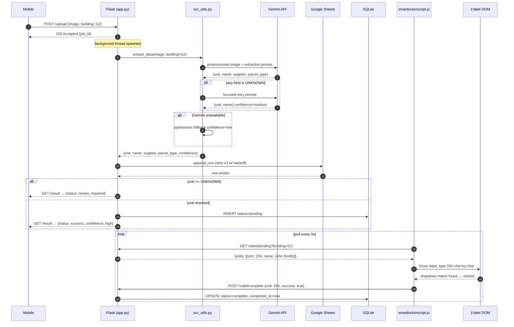
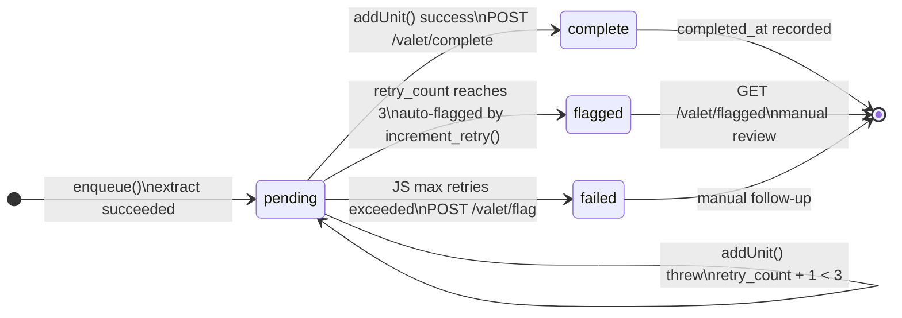

   [](https://github.com/nruppatel16/parcelvisioncloudsec/actions/workflows/ci.yml) 

LobbyOps automates parcel intake at a residential property with two buildings. When a package arrives, a staff member photographs the shipping label using a mobile shortcut. The image goes to a Flask backend running on EC2, which extracts the unit number and recipient name using the Gemini Vision API, logs the parcel to Google Sheets, and places the unit in a building-scoped queue. A JavaScript listener injected into the property management portal (1Valet) polls that queue and types each unit into the active delivery entry form -- no manual keyboard input required. The full cycle from photo to portal entry takes under fifteen seconds.

## Table of Contents

- [System Architecture](#system-architecture)
- [Request Lifecycle](#request-lifecycle)
- [Queue State Machine](#queue-state-machine)
- [Deployment](#deployment)
- [Security](#security)
- [Configuration](#configuration)
- [Buildings](#buildings)
- [Metrics](#metrics)
- [How the 1Valet automation works](#how-the-1valet-automation-works)
- [Accuracy](#accuracy)
- [Development](#development)

<details>
<summary>System Architecture</summary>



See [ARCHITECTURE.md](ARCHITECTURE.md) for the full technical breakdown.

</details>

<details>
<summary>Request Lifecycle</summary>

End-to-end sequence from photo to 1Valet entry.



</details>

<details>
<summary>Queue State Machine</summary>

Every parcel record in SQLite follows this lifecycle.



Flagged items surface in `GET /valet/flagged` (requires API key). Staff enter the unit manually in 1Valet and acknowledge the flag.

</details>

<details>
<summary>Deployment</summary>

### Local

```bash
cd lobbyops
pip install -r requirements.txt
cp .env.example .env
# Fill in GEMINI_API_KEY, API_KEY, SHEET_ID_G1, SHEET_ID_G2
export ENV=development
python app.py
```

The server starts on `0.0.0.0:5002`. In development mode, CORS is open and the startup variable check is skipped.

To inject the 1Valet listener into Chrome (Chrome must be running with `--remote-debugging-port=9222`):

```bash
python inject_tab.py http://localhost:5002 G2
```

### AWS

1. Store secrets in SSM Parameter Store under `/lobbyops/` (e.g., `/lobbyops/API_KEY`, `/lobbyops/GEMINI_API_KEY`).

2. Create a `terraform.tfvars` file:

```hcl
aws_region    = "ca-central-1"
key_pair_name = "your-key-pair"
admin_cidr    = "your.ip.address/32"
```

3. Apply the infrastructure:

```bash
cd lobbyops/infra
terraform init
terraform apply
```

4. The `user_data.sh` bootstrap script runs automatically on first launch. It installs dependencies, clones the repo, pulls secrets from SSM, mounts the EBS data volume, and enables the systemd service and nginx.

5. Point your domain at the Elastic IP output. Replace the Let's Encrypt placeholder paths in `nginx/lobbyops.conf` with your actual certificate paths and obtain a certificate with certbot.

To deploy updates after the initial setup:

```bash
ssh lobbyops@<elastic-ip> "bash /opt/lobbyops/scripts/deploy.sh"
```

</details>

<details>
<summary>Security</summary>

All `/valet/*` routes require an `X-API-Key` header compared with `hmac.compare_digest` (constant-time). Transport is HTTPS-only with HSTS. Flask is not directly exposed -- nginx proxies to `127.0.0.1:5002` with rate limiting and origin enforcement on `/valet/*`. File uploads are capped at 10 MB. All extracted strings are sanitized of control characters. Unit numbers are validated against a per-building allowlist using fuzzy matching. Secrets live in AWS SSM Parameter Store, not in source.

See [SECURITY.md](SECURITY.md) for the full operational security document, including key rotation procedure, known limitations, and vulnerability disclosure.

</details>

<details>
<summary>Configuration</summary>

All configuration is read from environment variables. Copy `.env.example` to `.env` and fill in values. The `config.py` module raises a hard error at startup if any required variable is missing when `ENV=production`.

```bash
# LobbyOps environment configuration.
# Copy to .env and fill values. Never commit the actual .env file.

# Required
GEMINI_API_KEY=           # Google Gemini Vision API key
API_KEY=                  # Secret key for /valet/* route auth (generate: openssl rand -hex 32)
SHEET_ID_G2=              # Google Sheets spreadsheet ID for Galleria 2
SHEET_ID_G1=              # Google Sheets spreadsheet ID for Galleria 1

# Optional (defaults shown)
WORKSHEET_G1=PACKAGES NEW
WORKSHEET_G2=PACKAGES NEW
CREDENTIALS_PATH=credentials.json          # Service account credentials for G2
G1_CREDENTIALS_PATH=credentials_g1.json   # Service account credentials for G1
RATE_LIMIT_PER_MINUTE=30
MAX_UPLOAD_SIZE_MB=10
ENV=production                             # Set to development to relax CORS and startup checks
LOG_LEVEL=INFO
DB_PATH=/data/lobbyops.db                  # Path to SQLite database
SERVER_URL=https://your-domain.com         # Used by inject_tab.py if not passed as arg
BUILDING=G2                                # Default building for inject_tab.py
```

</details>

## Buildings

| ID | Name | Address | Sheet name | Queue isolation |
|---|---|---|---|---|
| G1 | Galleria 1 | 10 Graphophone Grove | Configured via `WORKSHEET_G1` | `building = 'G1'` in all DB queries |
| G2 | Galleria 2 | 1285 Dupont St | Configured via `WORKSHEET_G2` | `building = 'G2'` in all DB queries |

Each building has its own Google Sheet, service account credentials file, and unit allowlist. The 1Valet listener is injected separately per building (`python inject_tab.py <url> G1` vs `G2`) and has `BUILDING` baked in at injection time, so the lobby PC for each building only sees and processes its own queue.

## Metrics

`GET /metrics` returns per-building counts. No authentication required.

```json
{
  "G1": {
    "today_total": 12,
    "today_complete": 10,
    "pending_count": 1,
    "failed_count": 0,
    "avg_processing_seconds": 8.3
  },
  "G2": {
    "today_total": 27,
    "today_complete": 26,
    "pending_count": 0,
    "failed_count": 1,
    "avg_processing_seconds": 7.1
  }
}
```

`GET /health` returns uptime in seconds alongside the same metrics payload.

## How the 1Valet automation works

The 1Valet portal is a standard web application that runs in Chrome. It has no public API for logging deliveries -- the only interface is a form accessed through the browser UI. LobbyOps bypasses this limitation using the Chrome DevTools Protocol.

When `inject_tab.py` runs, it connects to Chrome's CDP endpoint on `localhost:9222`, identifies the 1Valet tab (by URL match, then by tab index as a fallback), and sends a `Runtime.evaluate` message over WebSocket containing the full text of `smartlockerscript.js`. Chrome evaluates the script in the context of the active page. The WebSocket connection used for injection closes immediately after the response is received. From that point on, the injected script is self-contained in the browser and communicates with the backend using standard `fetch` calls.

The script starts a polling loop that hits `GET /valet/pending?building=G2` every five seconds. When the queue contains items, the script takes the first one and calls `addUnit`. That function finds the suite number input field by matching the `placeholder` attribute for the string `suite`, focuses it, and types the unit number one character at a time by dispatching synthetic `input` events with a 50ms delay between each character. The delay is necessary because 1Valet's input handler debounces keystrokes and needs time to update internal state before triggering the dropdown. After typing completes, the script looks for a dropdown entry whose text matches the unit number exactly and clicks it. If no dropdown entry appears, it dispatches a `keydown` event with `key: Enter` as a fallback. After a 1-second settle delay, it refocuses the input field in preparation for the next unit.

If `addUnit` throws at any point -- for example, because the popup was closed or the DOM changed -- the script retries with exponential backoff: 2 seconds, then 4 seconds, then 8 seconds. If all three retries fail, it calls `POST /valet/flag` on the backend, which marks the unit `flagged` in the database for manual follow-up. The polling loop then moves on rather than blocking on the same unit indefinitely.

The script maintains a session-scoped `processedUnits` set. If a unit appears in the queue that was already processed during this session, the script sends the completion acknowledgment immediately without re-running `addUnit`. This prevents duplicate entries if the completion POST failed but the DOM operation succeeded.

All console output uses plain `console.log`, `console.warn`, and `console.error`. Staff can observe queue activity, check running state with `valetStatus()`, and if needed manually call `startValetListener()`, `stopValetListener()`, or `valetClearCache()` from the Chrome DevTools console.

## Accuracy

Extraction uses three tiers in order:

**Tier 1 -- Gemini 2.5 Flash (primary):** The preprocessed image and a detailed prompt are sent to the Gemini Vision API. The prompt specifies the exact address formats used at each building, the building street numbers to reject as unit candidates (10 and 1285), valid supplier names, and parcel type classification rules. When Gemini returns parseable JSON, confidence is set to `high`.

**Tier 2 -- Focused retry:** If Gemini's first pass returns `UNKNOWN` for unit or name, a second call uses a shorter, narrowly targeted prompt asking only for those two fields. This resolves cases where the model read the full label correctly but produced a malformed response for one field. When the retry resolves a field, confidence becomes `medium`.

**Tier 3 -- pytesseract fallback:** If Gemini is unavailable or returns no parseable output at all, pytesseract runs on the preprocessed image with regex-based field extraction. Confidence is `low`. The image preprocessing pipeline (upscale, denoise via fast NL means, CLAHE contrast enhancement, sharpening kernel) runs before both Gemini and pytesseract to improve text legibility.

After extraction, the unit number is validated against the building's allowlist using `difflib.get_close_matches` with a cutoff of 0.85. A match within that threshold is corrected silently and logged. This catches common OCR substitutions (e.g., `0` for `O`, `1` for `I`) without requiring an exact hit. Units with no match at or above the threshold pass through unchanged.

Parcels where the unit is still `UNKNOWN` after all three tiers return a `review_required` status with the extracted data. They are not enqueued and not lost -- the image is saved to disk and the extracted fields are returned to the client for manual correction.

## Development

```bash
git clone https://github.com/nruppatel16/parcelvisioncloudsec.git
cd parcelvisioncloudsec/lobbyops
pip install -r requirements.txt
cp .env.example .env
```

Fill in `.env` with at minimum:

```
GEMINI_API_KEY=your-key
API_KEY=any-test-value
SHEET_ID_G1=your-g1-sheet-id
SHEET_ID_G2=your-g2-sheet-id
ENV=development
DB_PATH=/tmp/lobbyops_dev.db
```

Create a test Google Sheet (or a copy of the production sheet) and configure `SHEET_ID_G1`/`SHEET_ID_G2` to point at it. Place the corresponding service account credentials JSON files at `credentials.json` and `credentials_g1.json`.

For unit list validation, edit `units_g1.txt` and `units_g2.txt` to match your test unit numbers.

Run the server:

```bash
python app.py
```

Run tests:

```bash
pytest --cov=. -q
```

Run a manual extraction against an image:

```bash
python ocr_utils.py /path/to/label.jpg G2
```
